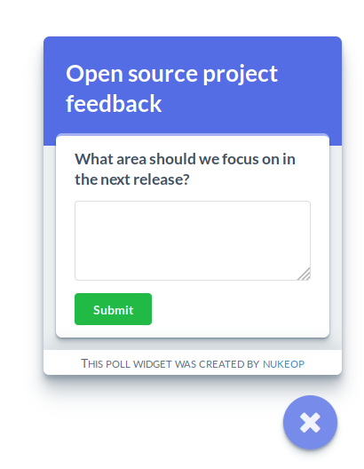
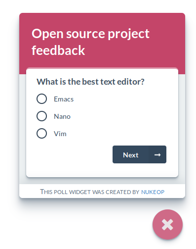
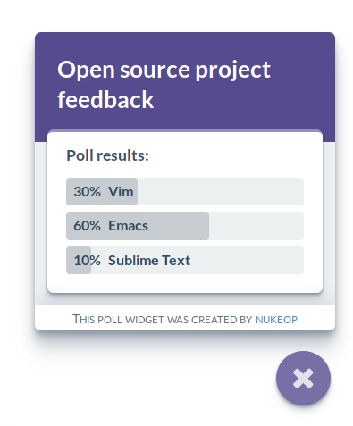

# react-poll-widget
Flexible poll widget for React

## Live demo
https://nukeop.github.io/react-poll-widget/

## npm
https://www.npmjs.com/package/@react-poll-widget/ui

## Screenshots





## Usage

```typescript
import {
  Panel,
  PanelContentHeader,
  TextAreaPoll
} from '@react-poll-widget/ui';

const Component = () => (
  <div>
    <PollUi.Panel>
      <PanelContentHeader>
        Describe your favorite animal:
      </PanelContentHeader>

      <TextAreaPoll />
    </Panel>
  </div>
);

```

For a full list of components and documentation, see [docs](docs/index.md).


## About
### License
Copyright © 2020, [nukeop](https://github.com/nukeop).
Released under the [Affero GPL License v3](LICENSE).
